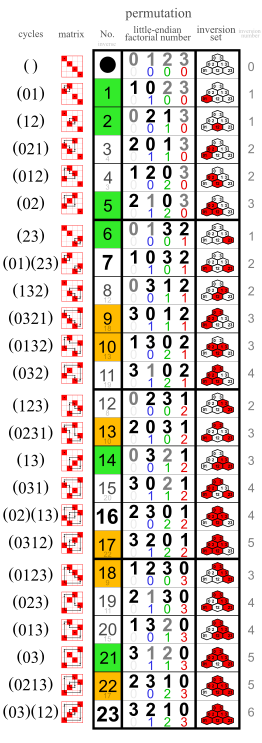
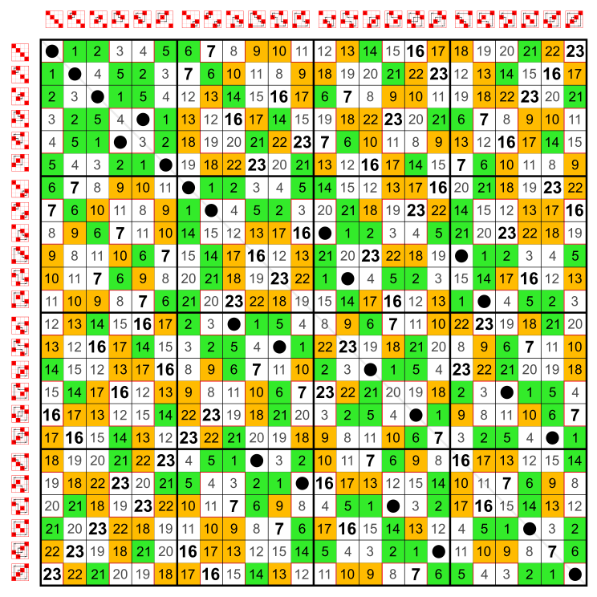

The variables in this test are numbered like in this list:

The compositions in this test are like in this Cayley table: 
`a * b` works like function composition (and can be thought of as _a after b_).

